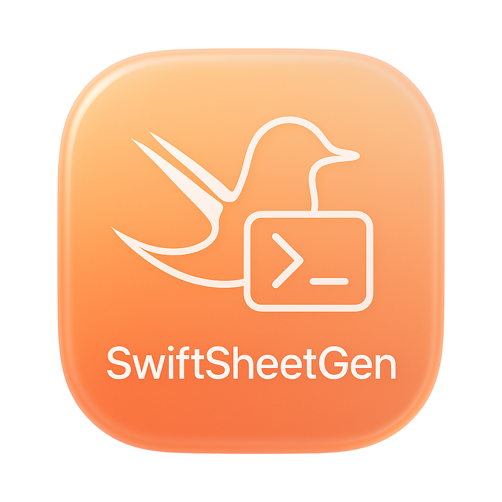

<p align="center">
  
</p>

<p align="center">
  <strong>Generate type-safe Swift code for localizations and colors directly from a Google Sheet.</strong>
</p>

<p align="center">
  <a href="https://github.com/jorgemrht/SwiftSheetGen/actions/workflows/ci.yml"></a>
  <a href="https://github.com/jorgemrht/SwiftSheetGen/releases"></a>
  <a href="https://swift.org"></a>
  <a href="/LICENSE"></a>
</p>

---

**SwiftSheetGen** is a command-line tool that turns your team’s Google Sheets for  **localizable strings**  and  **design system colors**  into  **compile-time–safe Swift APIs**, removing typos and keeping your Xcode project in sync—no manual file dragging, no missing resources.

## Overview

Managing strings and color tokens by hand is slow and error-prone: a mistyped key, a bad hex value, or a file not added to the project can cause crashes and UI inconsistencies.

SwiftSheetGen makes your  **Google Sheet the single source of truth**. Designers, translators, and developers collaborate in one place, and the tool  **generates typed Swift**:

-  **Strings**  → a strongly-typed API (e.g.,  `L10n.auth.loginTitle`) backed by localized resources, so invalid keys fail at  **compile time**.
    
- **Colors**  → a  `Color`  extension with static properties (e.g.,  `Color.brand.primary`) that prevents name/typo issues.
    
This automation keeps your project  **continuously synchronized**  with the sheet and reduces runtime surprises, while aligning with modern Apple patterns for localization (`String(localized:)` / String Catalogs) and SwiftUI color usage in Xcode projects.

# Getting started

## Install

You can install SwiftSheetGen in one of two ways:

### Option A — Homebrew (recommended)

```bash
brew tap jorgemrht/swiftsheetgen
brew install swiftsheetgen
```

### Updating

To update to the latest version, simply run the upgrade command:

```bash
brew upgrade swiftsheetgen
```

### Option B — Build from source


```bash
git clone https://github.com/jorgemrht/SwiftSheetGen.git
cd SwiftSheetGen
swift build -c release
install -m 755 .build/release/swiftsheetgen /usr/local/bin/swiftsheetgen
```

> Tip (Apple Silicon): Homebrew usually lives in /opt/homebrew. Adjust paths if needed.

## Supported Google Sheets URLs (required)

SwiftSheetGen accepts only Google Sheets that are **published to the web** and match one of these patterns (note the `/d/e/...` segment):

### Published HTML
https://docs.google.com/spreadsheets/d/e/<DOC_ID>/pubhtml

### Published CSV
https://docs.google.com/spreadsheets/d/e/<DOC_ID>/pub?output=csv

**Normalization**  
- `/pubhtml` is automatically transformed to `/pub?output=csv`.  
- Any other URL (e.g., `/edit`, `export?format=csv`, links with `gid=`) is rejected.

### How URLs are validated & normalized

Internally, URLs are:

- **Trimmed**  of whitespace.
- **Validated**  against these two regexes:
  -   `^https://docs\.google\.com/spreadsheets/d/e/[a-zA-Z0-9_.-]+/pubhtml$`      
  -   `^https://docs\.google\.com/spreadsheets/d/e/[a-zA-Z0-9_.-]+/pub\?output=csv$`
        
- **Transformed**  with this rule:
  - If the URL ends with  `/pubhtml`, it is  **converted**  to  `/pub?output=csv`
  - If it already ends with  `/pub?output=csv`, it’s used as-is
  - Anything else is rejected with  `invalidGoogleSheetsURL`
        
### Examples

-  ✅ Valid (HTML, will be auto-converted to CSV): `https://docs.google.com/spreadsheets/d/e/ABCD1234/pubhtml`  
-  ✅ Valid (already CSV): `https://docs.google.com/spreadsheets/d/e/ABCD1234/pub?output=csv` 
-  ❌ Invalid (not published; missing  `/d/e/…`  form): `https://docs.google.com/spreadsheets/d/ABCD1234/edit` 
    
> Privacy note: “Publish to the web” exposes a read-only version. Do not publish sensitive data.

## Quick Start

1. **Publish your Google Sheet to the web**  and copy a URL in one of the supported formats (see above). 
2. **Run the generator**
    
```bash
# Localizations
swiftsheetgen localization "https://docs.google.com/spreadsheets/d/e/ABCD1234/pubhtml"
# or (equivalent after normalization)
swiftsheetgen localization "https://docs.google.com/spreadsheets/d/e/ABCD1234/pub?output=csv"

# Colors
swiftsheetgen colors "https://docs.google.com/spreadsheets/d/e/WXYZ9876/pubhtml"
# or
swiftsheetgen colors "https://docs.google.com/spreadsheets/d/e/WXYZ9876/pub?output=csv"
```

3) **Open the generated files in Xcode**

```bash
./Localizables/
  en.lproj/Localizable.strings
  es.lproj/Localizable.strings
  ...
  L10n.swift                # strongly-typed API (enum)

./Colors/
  Colors.swift              # color tokens (static API)
  Color+Dynamic.swift       # helpers for dynamic variants
```

If automatic Xcode integration doesn’t occur, drag these paths into the desired target.

## Input quality & helpful rules (used by the tool)

- **Localization keys**
  - Must not be empty, start/end with spaces, contain quotes  `"`  or newlines.
  - If a key is invalid, the tool produces an error explaining  **why**  (e.g., “Key starts with a space”).    
- **CSV escaping**
  - Values containing quotes, commas, or newlines are automatically  **CSV-escaped**.
  - Arrays of strings are joined with commas into a single CSV row when needed.     
- **File system safety**
  - Output directories are created if missing and validated to avoid collisions with non-directory paths.
      
These rules keep outputs predictable and safe for CI/CD and for reproducible builds.

### Xcode integration

-   **Xcode 26 (recommended):**  SwiftSheetGen  **automatically adds**  the generated files to your Xcode project/targets the first time you run the tool in the project directory (and on subsequent runs it keeps them up to date).
    
-   **Xcode 15 and earlier:**  the  **first time**  you run the tool you’ll need to  **manually add**  the generated folders to your target(s). Subsequent runs will update the existing files in place.

> The tool scans the current directory and up to several parent directories to find a `.xcodeproj`. If you run it from elsewhere, pass `--output-dir /path/to/YourApp`.

# Detailed Usage Guide


SwiftSheetGen exposes  **two subcommands**:

### `localization`

**Usage**

`swiftsheetgen localization <PUBLISHED_SHEET_URL> [options]` 

**Positional argument (required)**

-   `<PUBLISHED_SHEET_URL>`  — a published Google Sheets URL (`/d/e/.../pubhtml`  or  `/pub?output=csv`, automatically normalized to CSV).
    

**Localization-specific options**

- `--swift-enum-name <Name>`  — name of the generated Swift enum.  **Default:**  `L10n`.
- `--enum-separate-from-localizations`  — write the enum file in the base  `--output-dir`  instead of inside  `Localizables/`.  **Default:** `false`. 
- `--use-strings-catalog`  — generate a  **`Localizable.xcstrings`**  catalog instead of `.strings`  files.  **Default:** `false`. 
    

**Outputs**

- One `.strings` file per language in `Localizables/<lang>.lproj/Localizable.strings`, **or** a single `Localizable.xcstrings` catalog if `--use-strings-catalog` is used.
- A strongly typed Swift enum (`L10n.swift`  by default, or the name you pass).
  
### `colors`

**Usage**

`swiftsheetgen colors <PUBLISHED_SHEET_URL> [options]` 

**Positional argument (required)**

- `<PUBLISHED_SHEET_URL>` — a published Google Sheets URL (`/d/e/.../pubhtml`  or  `/pub?output=csv`)
  
**Color-specific options**

-  None — this command only uses the shared options
    
**Outputs**

- `Colors/Colors.swift` and `Colors/Color+Dynamic.swift`.
    
### Shared options (for both subcommands)

- `--output-dir <path>` - base output directory (**default:**  `./`)
- `-v, --verbose` - enable verbose logging
- `--keep-csv` - keep the downloaded CSV instead of cleaning it up
    
> Internally, each subcommand writes into a fixed subfolder of the base output directory:  
> `localization`  →  `<output-dir>/Localizables`  
> `colors`  →  `<output-dir>/Colors`

## Tuist

If a `Project.swift` or `Workspace.swift` file is detected in your project's root, SwiftSheetGen will skip the automatic Xcode integration and print instructions for you to add the generated files to your Tuist manifest.

## Google Sheet Setup

Your sheet must be **published to the web** and follow these structures.

### Localizations sheet

Header row (exact labels):
[View] | [Item] | [Type] | <language codes…>

- `"[View]"`, `"[Item]"`, `"[Type]"` are **required** headers.
- After `[Type]`, add one column per language: `es`, `en`, `fr`, …
- First column can contain markers:
  - `[COMMENT]` → row is ignored
  - `[END]` → parsing stops

**Example (compact)**
| [View] | [Item] | [Type] | es | en |
|---|---|---|---|---|
| common | app_name | text | Mi App | My App |
| login | title | text | Iniciar sesión | Sign in |
| [END] |  |  |  |  |

> Keys are derived from `view_item_type`. Keys must not have leading/trailing spaces, quotes `"` or newlines.

### Colors sheet

Header row (exact labels):
[Color Name] | [Any Hex Value] | [Light Hex Value] | [Dark Hex Value]

- First column can contain `[COMMENT]` (ignored) or `[END]` (stop).

**Example (compact)**
| [Color Name] | [Any Hex Value] | [Light Hex Value] | [Dark Hex Value] |
|---|---|---|---|
| primaryBackgroundColor | #FFFFFF | #FFFFFF | #FFFFFF |
| onPrimary | #FFFFFF | #FFFFFF | #00172E |
| [END] |  |  |  |

## FAQ

**Q: Can I use a private Google Sheet?**  
**A:** No. SwiftSheetGen requires a **published** URL (`/pubhtml` or `/pub?output=csv`). “Publish to the web” exposes a **public, read-only** link. Do **not** publish sensitive data. For private workflows, export the CSV in CI to a secure location and feed that URL to the tool.

**Q: Can I customize the generated Swift code?**
**A:** For localizations, you can use the `--swift-enum-name` option to change the name of the generated enum. Other customizations are not available at this time but may be considered for future versions.

**Q: What happens if the Xcode integration fails?**
**A:** If the files don't appear in your project, you can simply drag the generated output directory (`Localizables` or `Colors`) from Finder into your Xcode Project Navigator. Make sure to select your main app target when prompted.

## License

This project is licensed under the MIT License - see the [LICENSE](LICENSE) file for details.

